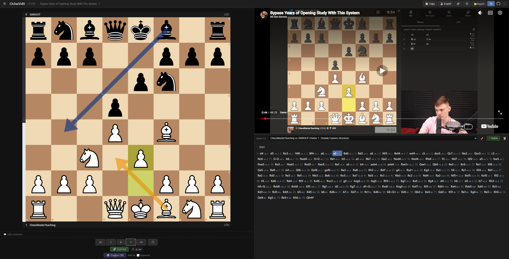

# Ch3ssVid5

[](https://github.com/sebbrochet/ch3ssvid5/actions/workflows/deploy.yml)
[](https://github.com/sebbrochet/ch3ssvid5)
[](https://www.gnu.org/licenses/gpl-3.0)

A web application that synchronizes chess game analysis with YouTube video commentary. Navigate through annotated PGN games on an interactive chessboard while the video automatically seeks to the corresponding position — or scrub the video and watch the board follow along.



## Features

### Core

- **Bidirectional sync** — click a move to seek the video, or play the video to advance the board
- **Cross-game sync** — in multi-game PGNs, the board auto-switches games as the video crosses timestamp boundaries
- **Interactive chessboard** — powered by [Chessground](https://github.com/lichess-org/chessground) (Lichess board)
- **YouTube integration** — embedded player with programmatic control via IFrame API
- **PGN timestamp annotations** — `{[%ts M:SS]}` format links moves to video timestamps
- **Move sounds** — distinct sounds for normal moves and captures

### PGN Editor

- **Full PGN support** — headers, moves, comments, NAGs, variations (RAVs)
- **Move tree** with Lichess-style variation display (indented, collapsible with fold/unfold toggles)
- **Board annotations** — arrows (`[%cal]`) and square highlights (`[%csl]`) drawn and persisted
- **Comments** — view/edit per-move comments with inline display and dedicated panel
- **NAG glyphs** — move quality indicators (`!`, `?`, `!!`, `??`, `!?`, `?!`) rendered on the board
- **Evaluation display** — `[%eval]` values shown inline + eval bar beside the board
- **Opening Explorer** — auto-detects ECO code and opening name as you navigate moves (3,690 openings from Lichess database)
- **Board flip** — toggle white/black perspective, persisted per game
- **Board editor** — full position editor with piece palette, eraser, FEN input/output, and validation
- **Promotion picker** — choose any piece (Queen, Rook, Bishop, Knight) when a pawn promotes
- **Player info bars** — names, Elo, team, result displayed above/below the board
- **Remove from here** — right-click context menu to truncate moves
- **Make main line** — right-click a variation to promote it to the main line
- **Create variations** — play a different move mid-game to branch the move tree
- **Miniboard preview** — hover over any move to see a miniature board of the resulting position
- **Edit game info** — edit all PGN headers including players, Elo, event, round, tags, difficulty, annotator

### Chess Variants

- **Chess960** — Scharnagl numbering (positions 0–959), random position generator, variant-aware move validation and castling
- **King of the Hill** — win by reaching the center squares
- **Three-check** — win by giving three checks
- **Antichess** — capture is mandatory, win by losing all pieces

### Game Library

- **Local storage persistence** — games auto-save as you edit
- **Folder hierarchy** — organize games into folders with drag & drop
- **Import/Export** — PGN files from disk (with native Save As dialog on Chromium), library backup as JSON
- **Multi-game PGN** — import Lichess studies with multiple chapters
- **Per-game VideoURL** — each game in a multi-game PGN can have its own video link
- **Game selector** — dropdown to switch between games in a file; video auto-seeks to the new game's first timestamp
- **Clone / delete game** — duplicate or remove games from the library

### Playlists

- **Create, rename, delete** playlists with auto-suffixed names for uniqueness
- **Add, remove, reorder** games (drag & drop on desktop, move up/down buttons on mobile)
- **Now Playing bar** — shows current playlist position with ⏮/⏭/✕ controls
- **Play through** — sequential game navigation with keyboard shortcuts (`Shift+↑/↓`)
- **Auto-advance** — 3-second countdown at end of game, auto-loads next game (cancellable)
- **Export/Import** — playlists as JSON (name-based game references, Hub-compatible)
- **Add to playlist** — right-click a game in the library to add it to any playlist

### Timestamp Workflow

- **Unsync mode** — decouple board and video for independent navigation
- **Capture timestamp** — stamp current video time onto the current move
- **Undo capture** — revert the last timestamp capture
- **Timestamp display** — shows timestamps next to moves when in unsync mode

### Engine Analysis

- **Stockfish 18** — WASM-based engine running in a Web Worker
- **Auto-analysis** — evaluates the current position on demand (depth 18)
- **Best move arrow** — engine's recommended move shown as a blue arrow
- **Eval bar** — vertical advantage indicator aligned with board orientation
- **Variant-aware** — engine auto-disables for unsupported variants (KOTH, Three-check, Antichess)

### Customization

- **Board themes** — Brown, Blue, Green, Purple, Grey (IC)
- **Piece sets** — 12 sets: CBurnett, Alpha, Maestro, Tatiana, Companion, Merida, California, Staunty, ICC, Horsey, Kosal, Letter
- **Square labels** — toggle coordinate labels on the board
- **Move animations** — animated SAN overlay on destination squares
- **Sound toggle** — enable/disable move sounds

### Layout

- **Resizable panels** — drag the horizontal splitter between video and move list
- **Responsive design** — mobile-friendly layout with stacked video/board/moves
- **Mobile sidebar** — overlay with backdrop, auto-closes on game selection
- **PWA** — installable progressive web app with offline support

### Internationalization

- **5 languages** — English, French, Spanish, German, Portuguese
- **Auto-detection** — uses browser language on first visit
- **Language switcher** — in the settings panel, persisted in localStorage

### P2P Sharing

- **Peer-to-peer** game transfer via PeerJS/WebRTC
- **4-digit code** — sender generates a code, receiver enters it to receive the game
- **No server** — direct browser-to-browser connection

### URL Import

- **One-click import** — share PGN links: `?pgn=URL&folder=Path`
- **Domain allowlist** — GitHub raw content, Gist, and self-hosted files
- **Confirmation dialog** — user must approve before importing
- **Sample games** — built-in examples on the welcome screen

### Keyboard Shortcuts

| Key             | Action                    |
| --------------- | ------------------------- |
| `←` / `→`       | Previous / Next move      |
| `↑` / `↓`       | First / Last move         |
| `Home` / `End`  | First / Last move         |
| `Shift+↑` / `↓` | Playlist prev / next game |
| `F`             | Flip board                |
| `C`             | Capture timestamp         |
| `E`             | Toggle engine             |
| `Space`         | Play / Pause video        |

## Tech Stack

- **React 18** + TypeScript
- **Vite** — build tool and dev server
- **Chessground** — interactive chess board (Lichess)
- **chessops** — move validation, FEN parsing, variant support
- **Stockfish WASM** — browser-based chess engine
- **YouTube IFrame API** — video embedding and control
- **PeerJS** — P2P game sharing via WebRTC
- **react-i18next** — internationalization (5 languages)

## Getting Started

### Prerequisites

- Node.js 18+
- npm

### Install & Run

```bash
git clone https://github.com/sebbrochet/ch3ssvid5.git
cd ch3ssvid5
npm install
npm run dev
```

Open [http://localhost:5173](http://localhost:5173)

### Build for Production

```bash
npm run build
```

Output in `dist/`.

### Preview Production Build

Preview locally exactly as it will appear in production:

```bash
npm run build && npm run preview
```

Open [http://localhost:4173/](http://localhost:4173/)

## Deployment

The app auto-deploys to GitHub Pages on push to `main` via GitHub Actions.

Live at: [https://ch3ssvid5.sebbrochet.com](https://ch3ssvid5.sebbrochet.com)

## PGN Format

The app uses standard PGN with custom `[%ts]` annotations for video sync:

```pgn
[Event "Game Analysis"]
[VideoURL "https://www.youtube.com/watch?v=VIDEO_ID"]

1. e4 {[%ts 0:35]} e5 {[%ts 0:52]}
2. Nf3 {[%ts 1:15]} Nc6 {[%ts 1:28]}
```

Supported PGN annotations:

- `{[%ts M:SS]}` — video timestamp
- `{[%cal Ge2e4]}` — arrows (Green/Red/Blue/Yellow)
- `{[%csl Ge4]}` — square highlights
- `{[%eval 0.54]}` — position evaluation
- `{comment text}` — move comments
- `(variation moves)` — recursive annotation variations (RAVs)
- `!`, `?`, `!!`, `??`, `!?`, `?!` — NAG symbols

## Development

### Code Quality

```bash
npm run lint          # ESLint
npm run format        # Prettier auto-fix
npm run typecheck     # TypeScript check
npm test              # Vitest unit tests
npm run validate      # All of the above in one command
```

Pre-commit hooks (via Husky + lint-staged) automatically lint and format staged files.

### Testing

**Unit tests** (Vitest) — 265+ tests across 13 test files:

- PGN parsing, move tree, chess position helpers, Chess960 encoding
- Board validation, eval display, game sync, URL import, opening lookup
- Game library CRUD, playlist management, P2P sharing, Stockfish integration

**E2E tests** (Playwright) — 10 spec files:

- Navigation, game lifecycle, library management, import/export
- Comments & settings, i18n, themes, mobile, welcome screen

```bash
npx vitest run                    # Unit tests
npx playwright test               # E2E tests (all browsers)
npx playwright test --project=desktop-chrome  # E2E (Chrome only)
```

### CI Pipeline

On push to `main`, GitHub Actions runs: typecheck → lint → format check → tests → audit → build → deploy.

## Contributing

1. Fork the repo
2. Create a feature branch
3. Run `npm run validate` before committing
4. Submit a PR — the template will guide you

## License

[GPL-3.0-or-later](LICENSE)
